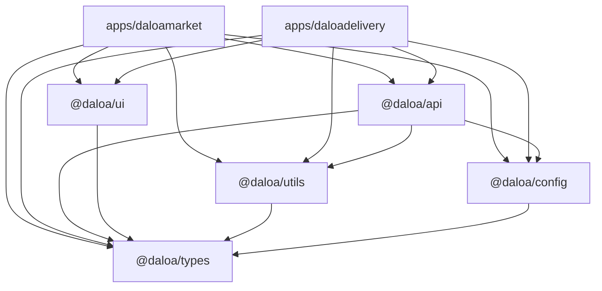
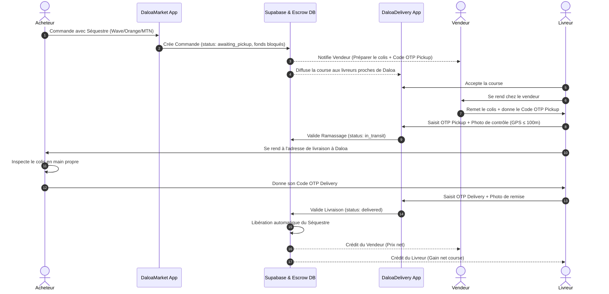

# 🏛️ Architecture Technique & Écosystème Mobile Daloa

Ce document décrit l'architecture globale, les choix techniques et l'organisation du monorepo des applications mobiles Android **DaloaMarket** et **DaloaDelivery**.

---

## 1. Vue d'Ensemble du Monorepo

Le projet est structuré sous la forme d'un monorepo propre et modulaire utilisant **pnpm workspaces** et **TypeScript**.

```
DM_DD/
├── apps/
│   ├── daloamarket/          # Application Mobile Marketplace (Acheteurs & Vendeurs)
│   └── daloadelivery/        # Application Mobile Livreur & Flotte Logistique
├── packages/
│   ├── types/                # Déclarations TypeScript partagées (DB, Listings, Orders, Delivery, Auth)
│   ├── config/               # Constantes métier (Daloa GPS, 50+ quartiers, tarifs, notifications)
│   ├── utils/                # Utilitaires purs (Haversine GPS, formatteurs FCFA/Date, Zod, Haptics)
│   ├── api/                  # Client Supabase chiffré, services métier et hooks TanStack React Query
│   └── ui/                   # Système de design bespoke React Native (Tokens, Boutons, Cartes, OTP...)
└── docs/                     # Documentation complète du projet
```

---

## 2. Dépendances entre Packages



---

## 3. Flux Financier Séquestre (Escrow)

Le protocole Escrow garantit qu'aucun fonds n'est débité sans livraison effective :



---

## 4. Spécifications des Applications

### 🛍️ DaloaMarket (`apps/daloamarket`)
- **Package Android** : `com.daloamarket.app`
- **Schéma d'URL (Deep linking)** : `daloamarket://`
- **Thème Visuel** : Deep Orange (`#F97316`), Dark Slate surfaces (`#0B0F17`), Emerald Escrow (`#10B981`).
- **Cible** : Habitants et commerçants de Daloa.

### 🛵 DaloaDelivery (`apps/daloadelivery`)
- **Package Android** : `com.daloamarket.delivery`
- **Schéma d'URL (Deep linking)** : `daloadelivery://`
- **Thème Visuel** : Electric Cyan (`#06B6D4`), Deep Slate Navy (`#090D16`), Driver Orange accents.
- **Cible** : Livreurs indépendants et coursiers partenaires de Daloa.

---

## 5. Sécurité et Persistance

1. **Tokens d'Authentification** : Persistés de façon chiffrée sur le stockage sécurisé Android via `Expo SecureStore` (`SecureStorageAdapter`).
2. **Double Contrôle OTP** :
   - Chaque code OTP (`pickup_otp` et `delivery_otp`) est généré cryptographiquement et stocké haché / protégé par Row-Level Security (RLS) sur Supabase.
   - La validation impose la présence d'une photo de preuve stockée dans le bucket `delivery-proofs`.
   - La vérification géospatiale s'assure que le livreur se trouve à moins de 100 mètres du point de ramassage ou de livraison.
3. **Temps Réel** : WebSockets Supabase Realtime avec canaux dédiés pour la mise à jour instantanée du statut des commandes, des livraisons et des messages de chat.
